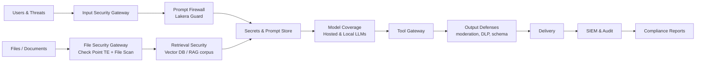
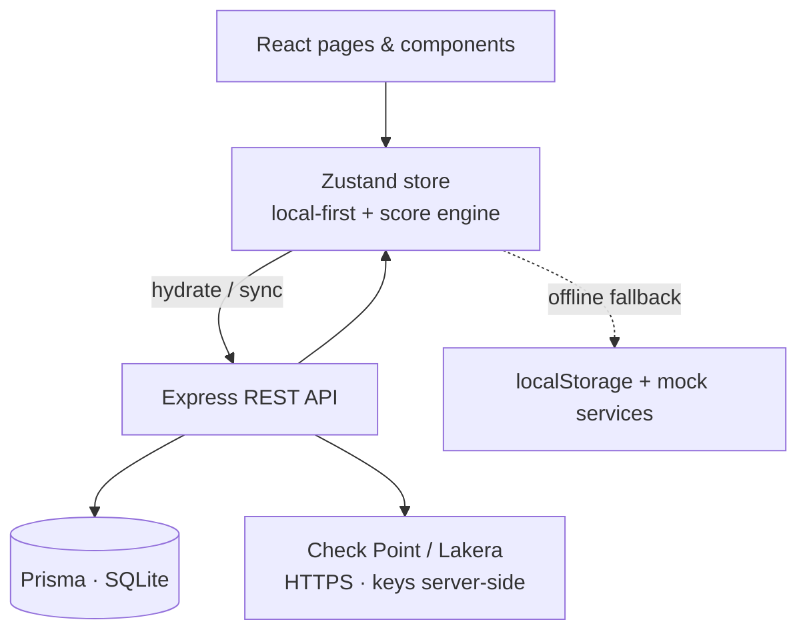

# AI Security Stack Mapper — Executive Summary

**Document type:** Project overview & solution brief
**Audience:** Security leadership, AppSec/SOC teams, platform & ML stakeholders
**Status:** v1.0.0 — released (mock-first, persistence-enabled)
**Date:** 2026-06-23

---

## 1. The problem

Organizations are shipping LLM-powered applications faster than they can secure
them. Unlike traditional apps, an LLM application has a **wide, layered attack
surface**: a single user request flows through input handling, retrieval (RAG),
system prompts and secrets, the model itself, tool/agent execution, output
rendering, delivery, and monitoring. Each layer introduces distinct risks —
prompt injection, jailbreaks, sensitive-data leakage, unsafe tool execution,
retrieval poisoning, insecure output handling — and most teams have **no single
place** to see which layers are protected, where the gaps are, and what to fix
first.

## 2. The solution

The **AI Security Stack Mapper** is a SOC-style dashboard that lets a team
**map, assess, and secure every layer of an LLM application stack**. It models
the application as a **defense-in-depth pipeline**, visualizes how prompts and
files flow through security controls, shows where attacks can happen, and tracks
which controls mitigate each risk — producing a single **AI Security Score** and
an exportable assessment report.

It ships with realistic demo data and integrates **Check Point Threat Emulation
/ TE File Scan** (file security) and **Lakera Guard** (prompt firewall), plus
full **LLM coverage management** for hosted and local models.

> **One-line value:** Turn "we have an LLM app somewhere in production" into a
> measured, layer-by-layer security posture with a clear remediation plan.

---

## 3. How it works — the defense-in-depth flow

Every request and ingested document is treated as untrusted and passes through
a sequence of security zones. The app maps controls onto each zone:

- **Files** (uploads, KB documents, email attachments) are detonated/scored by
  **Check Point** before they can enter the vector DB. Malicious or suspicious
  verdicts are **blocked from the RAG corpus**.
- **Prompts** are screened by **Lakera Guard** for injection, jailbreak, unsafe
  content, and leakage — returning a risk score and a decision
  (**allow / block / redact / escalate**). Outputs can be screened the same way.
- **Models** (OpenAI, Azure, Anthropic, Gemini, Llama, Mistral, Cohere, local
  runtimes, custom) are registered with their guardrail and isolation posture.
- **Every event** is designed to flow to SIEM/audit for detection and
  compliance reporting.

---

## 4. What a user does (workflow)

1. **Dashboard** — see the overall AI Security Score, protected layers, open
   risks, critical gaps, vendor-protection metrics, and recent incidents.
2. **LLM Stack Map** — view the interactive defense-in-depth diagram; nodes are
   color-coded by status; click any node to inspect/edit it.
3. **Layer Assessment** — mark each control as *Not implemented → Planned →
   Implemented → Verified*.
4. **Risk Register** — track LLM-specific threats, severity, and mitigating
   controls (mapped to the OWASP Top 10 for LLM Apps).
5. **Control Library / Architecture Builder** — browse, filter, add controls, or
   drag controls onto the canvas to design the architecture.
6. **Integrations** — File Security Gateway, Lakera Guard, and Model Coverage do
   the live (mock) work: scan files, inspect prompts, register models.
7. **Report Generator** — export an executive report (Markdown or PDF) with
   findings, gaps, and a remediation plan.

---

## 5. The AI Security Score

A single 0–100 score (graded A–F) combines:

- **Weighted control coverage** — credit scales with control maturity
  (Planned 25% → Implemented 75% → Verified 100%).
- **Bonuses** — Check Point file scanning enabled; Lakera Guard input/output
  protection; fully-guardrailed production models; network-isolated local LLMs;
  per-model tool restriction.
- **Penalties** — files entering RAG unscanned; missing logging, output
  moderation, tool restriction, or secrets management; models missing
  input/output guardrails; local LLMs with internet access or unrestricted
  tools; unresolved critical risks.

The score updates **live** as controls, integrations, and model posture change,
so remediation progress is immediately visible.

---

## 6. Data model

| Entity | Represents |
| --- | --- |
| `Project` | An LLM application under assessment |
| `StackLayer` | A defense-in-depth zone (input, file, model, …) |
| `SecurityControl` | A mitigation, mapped to a layer + OWASP category |
| `Risk` | An LLM-specific threat with severity & mitigating controls |
| `Assessment` | A control's implementation status over time |
| `Evidence` | Proof a control is in place |
| `Incident` | A detected security event |
| `ComplianceMapping` | OWASP LLM Top-10 coverage status |
| `Integration` | A vendor connector (Check Point, Lakera) + health |
| `ModelCoverage` | A registered hosted/local LLM and its posture |
| `FileScan` | A file scan record + verdict + evidence |
| `PromptInspection` | A Lakera Guard prompt/output verdict |

---

## 7. Architecture & technology

**Frontend SPA** — React 18 + TypeScript (Vite), Tailwind + DaisyUI dark SOC
theme, React Flow (interactive map + drag/drop builder), Zustand state.
**Backend API** — Node.js + Express, Prisma ORM over SQLite, with server-side
vendor integration endpoints (keys never reach the browser).
**Model** — the app is **local-first**: it works fully offline against seed data
and in-browser mocks, and hydrates from / syncs to the backend when it is
reachable.

### Security & data handling
- **No hardcoded secrets.** API keys are read only from environment variables;
  until configured, integrations run in **mock mode** with no network calls.
- **HTTPS only**; TLS verification is never disabled.
- Files are hashed locally (SHA-256); no bytes leave the browser in mock mode.
- For production, vendor calls should be **proxied through a backend** that holds
  the unprefixed secrets server-side (a Vite frontend would otherwise expose
  `VITE_`-prefixed keys to the browser).

---

## 8. Current status & next steps

**Released v1.0.0 (2026-06-23):** full dashboard suite, interactive stack map,
risk register, control library, architecture builder, compliance frameworks
(OWASP LLM Top 10, NIST AI RMF, EU AI Act, ISO/IEC 42001, MITRE ATLAS), report
export, Check Point + Lakera + model-coverage integrations, local LLM
testing/evaluation, **Express + Prisma** backend (SQLite dev / Postgres via
Docker), **JWT auth + RBAC** (Owner/AppSec/SOC/Viewer), user management,
server-stored preferences, Docker Compose one-command stack, CI with an **AI
Security Score gate**, and Vitest + Playwright test coverage. Type-checks clean
and builds for production.

**Recommended next steps:**
1. **Live vendor credentials** in production deployments (mock→live switchover
   is already wired).
2. **Live SIEM forwarding** and automated SOC ticket creation.
3. **Production Postgres** deployment with audit history and TLS termination.
4. **Raise the AI Security Score** from the demo baseline (~50) toward production
   targets (CI gate threshold can be raised over time).
5. **Enable Playwright E2E in CI** for full regression on every push.

---

*Generated for the AI Security Stack Mapper project. See `README.md` for setup
and run instructions, and `src/lib/score.ts` for the scoring implementation.*
